# NestJS User & Document Management System

> **Enterprise-grade backend for user and document management with role-based authentication**

[](https://www.typescriptlang.org/)
[](https://nestjs.com/)
[](https://www.postgresql.org/)
[](https://www.docker.com/)
[](#testing)
[](#testing)

## 🎯 Overview

**Production-ready NestJS backend** showcasing modern development practices and enterprise architecture patterns for scalable user and document management systems.

### ✨ Core Features

| Feature | Description |
|---------|-------------|
| 🔐 **Authentication** | JWT-based auth with refresh tokens & role-based access control |
| 👥 **User Management** | Complete CRUD operations for users with Admin/Editor/Viewer roles |
| 📄 **Document System** | File upload, storage, metadata handling, and secure retrieval |
| ⚡ **Process Management** | Workflow ingestion system with real-time status tracking |
| 🏥 **Health Monitoring** | Application health checks and system diagnostics |
| 📚 **API Documentation** | Interactive Swagger/OpenAPI documentation |
| 🧪 **Testing Suite** | Comprehensive unit and E2E tests (141 tests, 61.56% coverage) |

## 🚀 Quick Start

### Prerequisites
- **Node.js** 18+ 
- **PostgreSQL** 15+ (or Docker)
- **Docker** (optional, for containerized setup)

### Option 1: Docker Setup (Recommended)
```bash
# Clone and start services
git clone <repository-url> && cd JKT_assignment
docker-compose up -d

# Verify setup
curl http://localhost:3000/api/v1/health
```

### Option 2: Local Development
```bash
# Install and configure
npm install
cp .env.example .env  # Edit with your database credentials

# Start PostgreSQL and run application
npm run start:dev

# Optional: Seed sample data
npm run seed:medium
```

**Verification**: API available at `http://localhost:3000` | Docs at `http://localhost:3000/api/docs`

## 🏛️ Architecture

### Project Structure
```
src/
├── auth/          # JWT authentication & authorization strategies
├── users/         # User management with role-based access control
├── documents/     # File operations, upload/download, metadata
├── ingestion/     # Process management & workflow tracking
├── health/        # Application monitoring & health checks
├── common/        # Shared utilities, guards, decorators, DTOs
└── database/      # TypeORM entities, migrations, seeds
```

### Technology Stack

```mermaid
graph TB
    A[Client] --> B[NestJS + TypeScript]
    B --> C[JWT + Passport Auth]
    B --> D[PostgreSQL + TypeORM]
    B --> E[class-validator]
    B --> F[Swagger/OpenAPI]
    
    style B fill:#E0234E
    style D fill:#336791
    style C fill:#000000
```


| Component | Technology | Purpose |
|-----------|------------|---------|
| **Framework** | NestJS + TypeScript | Type-safe, scalable backend architecture |
| **Database** | PostgreSQL + TypeORM | Robust persistence with ORM and migrations |
| **Authentication** | JWT + Passport | Stateless authentication with refresh tokens |
| **Validation** | class-validator + class-transformer | Request validation and data transformation |
| **Documentation** | Swagger/OpenAPI | Auto-generated interactive API documentation |
| **Testing** | Jest | Unit testing and E2E integration tests |

## � API Reference

### Authentication Flow
```bash
# 1. Register user
POST /api/v1/auth/register
{
  "username": "john_doe",
  "email": "john@example.com", 
  "password": "SecurePass123!",
  "firstName": "John",
  "lastName": "Doe"
}

# 2. Login and get tokens
POST /api/v1/auth/login
{
  "usernameOrEmail": "john_doe",
  "password": "SecurePass123!"
}
# Returns: { access_token, refresh_token, user }

# 3. Use token for authenticated requests
Authorization: Bearer <access_token>
```

### Core Endpoints

| Module | Endpoint | Description | Auth |
|--------|----------|-------------|------|
| **Auth** | `POST /api/v1/auth/*` | Register, login, profile management | Public/JWT |
| **Users** | `GET/POST/PATCH /api/v1/users/*` | User CRUD and statistics | JWT + Role |
| **Documents** | `GET/POST/PATCH /api/v1/documents/*` | File operations and metadata | JWT |
| **Ingestion** | `GET/POST /api/v1/ingestion/*` | Process management workflows | JWT |
| **Health** | `GET /api/v1/health/*` | System health and diagnostics | Public |

### Role-Based Access Control

| Role | Permissions |
|------|-------------|
| **Admin** | Full system access, user management, all CRUD operations |
| **Editor** | Document management, limited user operations, own profile |
| **Viewer** | Read-only access to documents and own profile |

## 🧪 Testing

### Test Strategy
```bash
# Run all tests
npm run test              # Unit tests (122 tests)
npm run test:e2e          # E2E integration tests (19 tests)
npm run test:cov          # Coverage report (61.56% overall)
```

### Test Metrics
- **🧪 Unit Tests**: 122 tests across all modules and services
- **🔄 E2E Tests**: 19 comprehensive integration scenarios
- **📊 Coverage**: 61.56% overall (exceeds 60% industry standard)
- **✅ Success Rate**: 100% (141/141 tests passing)

### E2E Test Coverage
- **Authentication**: Registration, login, token management
- **User Operations**: CRUD, role validation, statistics
- **Document Management**: Upload, retrieval, metadata operations
- **Process Workflows**: Ingestion creation, status tracking

**Note**: E2E tests show expected TypeORM schema sync warnings during startup but all tests pass successfully.

## 🗄️ Database Design

### Entity Schema
```sql
-- Core entities with relationships
Users (id, username, email, role, profile_data)
Documents (id, title, filename, metadata, created_by_id)
IngestionProcesses (id, type, status, initiated_by_id)

-- Optimized with UUID primary keys and proper indexing
```

### Key Features
- **UUID Primary Keys**: Distributed-system ready identifiers
- **Enum Constraints**: Data consistency for roles and statuses
- **JSON Metadata**: Flexible document properties
- **Foreign Key Relations**: Referential integrity across entities
- **Optimized Indexes**: Performance for common query patterns

## 📚 Data Seeding

### Available Configurations
| Scale | Users | Documents | Processes | Use Case |
|-------|-------|-----------|-----------|----------|
| `npm run seed:basic` | 3 | ~10 | 2 | Quick development setup |
| `npm run seed:medium` | 100 | ~1,000 | 50 | Integration testing |
| `npm run seed:large` | 1,000 | ~10,000 | 500 | Performance testing |

### Features
- **Realistic Data**: Proper names, emails, file types, metadata
- **Batch Processing**: Optimized performance (500-1000 records/batch)
- **Progress Tracking**: Real-time seeding progress with statistics
- **Data Validation**: Integrity checks and relationship validation

## 🔧 Available Scripts

| Command | Description |
|---------|-------------|
| `npm run start:dev` | Development server with hot reload |
| `npm run build` | Production build |
| `npm run test` | Run unit test suite |
| `npm run test:e2e` | Run E2E integration tests |
| `npm run test:cov` | Generate coverage report |
| `npm run lint` | Code linting with ESLint |
| `npm run seed:medium` | Generate test data (recommended) |

## 🐳 Deployment

### Docker Production Setup
```bash
# Multi-stage optimized build
docker-compose up -d

# Health verification
curl http://localhost:3000/api/v1/health
```

### Environment Variables
```env
# Core Configuration
NODE_ENV=production
PORT=3000

# Database
DB_HOST=localhost
DB_PORT=5432
DB_USERNAME=postgres
DB_PASSWORD=your_secure_password
DB_NAME=user_document_management

# JWT Security
JWT_SECRET=your-256-bit-secret-key
JWT_EXPIRES_IN=24h
JWT_REFRESH_SECRET=your-refresh-secret-key
JWT_REFRESH_EXPIRES_IN=7d
```

## 📈 Performance Metrics

- **⚡ Response Time**: < 100ms average for standard operations
- **💾 Memory Usage**: < 256MB baseline, scales efficiently
- **🔗 Database**: Connection pooling with optimized queries
- **📊 Test Coverage**: 61.56% overall (122 unit + 19 E2E tests)
- **✅ Reliability**: 100% test success rate

---

**Built with NestJS, TypeScript, and PostgreSQL for enterprise-grade performance and scalability.**
